# Rasterizer

## CPU based rasterizer

An experimental CPU based rasterizer, which contains basic features and is inspired by OpenGL.

- [Rasterizer](#rasterizer)
  - [CPU based rasterizer](#cpu-based-rasterizer)
- [Features](#features)
  - [Triangle rendering](#triangle-rendering)
  - [Camera](#camera)
  - [Color interpolation](#color-interpolation)
  - [Textures](#textures)
  - [Depth buffer](#depth-buffer)
  - [3D models](#3d-models)
  - [Lights](#lights)
  - [Materials](#materials)
  - [Blending](#blending)
  - [Stencil buffer](#stencil-buffer)
  - [Perspective correction](#perspective-correction)
  - [Back face culling](#back-face-culling)
- [External libraries](#external-libraries)
  - [SudoMaths](#sudomaths)
  - [Glad](#glad)
  - [Glfw](#glfw)
  - [ImGui](#imgui)
  - [Stb image](#stb-image)
  - [Tiny obj](#tiny-obj)
- [Resources](#resources)

# Features 

Below is a list of the different features available in this project :

## Triangle rendering

Given a list of 3 points in Normalized Device Coordinates (NDC) space, the standard transformation pipeline (model, view, projection, viewport) is applied and the triangle is rendered in screen space while being filled with its color.

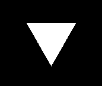
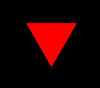

## Camera

A simple camera can be used to view the scene, its position and center can be changed, as well as its FOV and near/far clip planes.
The corresponding view and projection matrices based on these values are forwarded to the renderer.

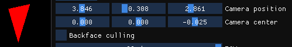

## Color interpolation

The colors between the points are linearly interpolated inside of the triangle, thus resulting in a blend between the colors.

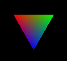

## Textures

Textures can be loaded from a file (either PNG or JPG) and applied to any triangle by using texture coordinates.
The texture is merged with the interpolated color showed previously.

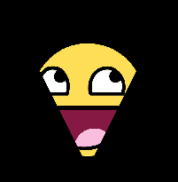
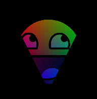

## Depth buffer

The depth buffer allows triangles that should be rendered behind other triangles to be partially discarded (on a fragment basis), which allows correct 3D order rendering and overlap.

## 3D models

3D models using the Obj format can be loaded and rendered.

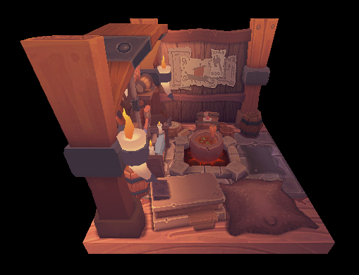

Each object has its own position, rotation and scaling and they can be modified independently.

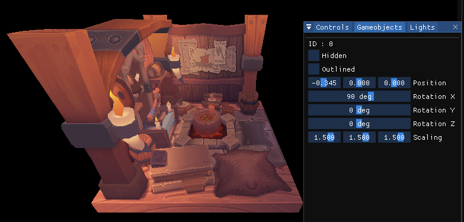

## Lights

The support for 8 simultaneous lights is currently in place, each light uses the Phong illumination model (ambiant, diffuse, specular).

The lights also support attenuation (linear, quadratic and radius).

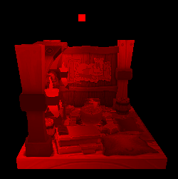
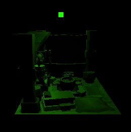
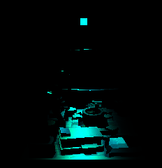
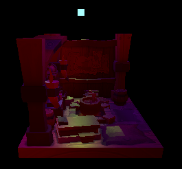

## Materials

Each object can have its own material, which is used to impact how light reflects off of it.

## Blending

Blending makes use of the alpha component, it can blend multiple colors together, allowing for transprency.

I used the same operations and equations as OpenGL for this, at least what [this page](https://learnopengl.com/Advanced-OpenGL/Blending) says about it.

Also most of them aren't tested, since the only one that's really useful is srcAlpha, 1-srcAlpha, Add.

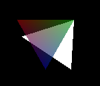

## Stencil buffer

A very basic stencil buffer was implemented, it supports writing to the buffer when the color buffer is written to, and discarding fragments based on the value of the buffer.

It's currently used to create a simple outline effect on the models.

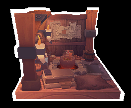

## Perspective correction

Perspective correction is implemented in the renderer, allowing for correct texture and color interpolation.

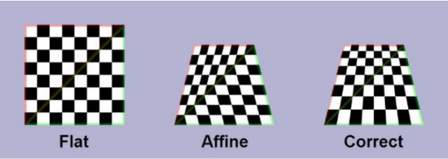

## Back face culling

Back face culling is technically implemented, however it doesn't fully work properly (it discards faces that it shouldn't)

# External libraries

## SudoMaths

SudoMaths is a 3D oriented Maths library that I made myself, currently used to handle all the Vector/Matrix maths.

## [Glad](https://github.com/Dav1dde/glad)

Glad is a C binding for the OpenGL APi, I use it in conjuction with ImGui to render.

## [Glfw](https://github.com/glfw/glfw)

Glfw is an API used to handle native Windows.

## [ImGui](https://github.com/ocornut/imgui)

ImGui is a graphical user interface library, I use it for the UI parts of the application.

## [Stb image](https://github.com/nothings/stb/blob/master/stb_image.h)

Stb image is image loading library, currently used to load the textures.

## [Tiny obj](https://github.com/tinyobjloader/tinyobjloader)

Stb image is a 3D model loader library, currently used to load the obj models.

# Resources

Here's a few of the resources and documentations I used for this project :

[Transformation pipeline](https://stanford.edu/class/ee267/lectures/lecture2.pdf)

[Barycentric coordinates and interpolation](https://codeplea.com/triangular-interpolation)

[3D model loading](https://vulkan-tutorial.com/Loading_models)

[Lighting](https://learnopengl.com/Lighting/Basic-Lighting)

[Light attenuation](https://docs.blender.org/manual/en/2.79/render/blender_render/lighting/lights/attenuation.html)

[Stencil buffer](https://learnopengl.com/Advanced-OpenGL/Stencil-testing)

[Blending](https://learnopengl.com/Advanced-OpenGL/Blending)

[Perspective correction](https://stackoverflow.com/questions/24441631/how-exactly-does-opengl-do-perspectively-correct-linear-interpolation)

[Back face culling](https://en.wikipedia.org/wiki/Back-face_culling)

